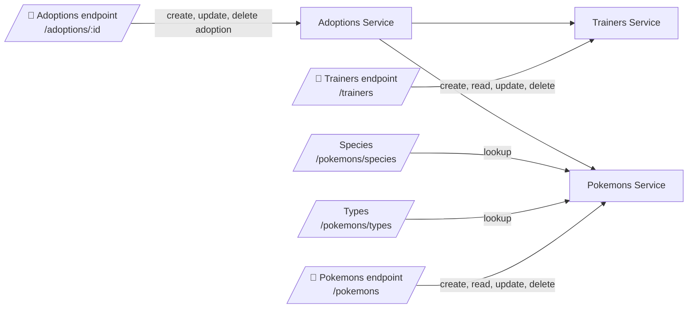

# Backend 3 85685 entrega-final

A NestJS backend application designed for Coderhouse's Backend 3 course for managing trainers, pokemons, and adoptions using MongoDB.

The project is built with NestJS, Mongoose, class-validator, and Jest for testing. It includes dedicated modules for trainers, pokemons, and adoption workflows, along with middleware for request logging.

## Project Setup

1. Install dependencies

```bash
npm install
```

2. Create a `.env` file at the project root with your MongoDB connection string:

```bash
MONGO_URL=mongodb://localhost:27017/your-db-name
```

3. Start the application

```bash
npm run start:dev
```

## Run

- `npm run start` - start the server
- `npm run start:dev` - start in watch mode
- `npm run start:prod` - run compiled production build
- `npm run build` - compile TypeScript into `dist`

## Testing

This project includes comprehensive unit tests, integration tests, and end-to-end tests with **121 total tests**.

### Unit & Integration Tests

Unit tests verify individual service methods and controller endpoints with mocked dependencies.
Integration tests verify controller endpoints work correctly with mocked services.

```bash
npm run test              # Run all unit and integration tests
npm run test:watch       # Run tests in watch mode (auto-rerun on changes)
npm run test:cov         # Generate coverage report
```

**Test Files:**
- `src/trainers/trainers.service.spec.ts` - Unit tests for trainers service (create, findAll, findOne, update, remove)
- `src/trainers/trainers.controller.spec.ts` - Integration tests for trainers endpoints
- `src/pokemons/pokemons.service.spec.ts` - Unit tests for pokemons service (create, findAll, findOne, update, remove, getTypes, getSpecies)
- `src/pokemons/pokemons.controller.spec.ts` - Integration tests for pokemons endpoints
- `src/adoptions/adoptions.service.spec.ts` - Unit tests for adoptions service (create, update, remove)
- `src/adoptions/adoptions.controller.spec.ts` - Integration tests for adoptions endpoints
- `src/app.controller.spec.ts` - Unit tests for root endpoint

### End-to-End Tests

E2E tests verify the entire application stack from HTTP request to database response, testing real flows without mocking services.

```bash
npm run test:e2e                                    # Run all e2e tests
npm run test:e2e -- trainers.e2e-spec.ts          # Run trainers e2e tests
npm run test:e2e -- pokemons.e2e-spec.ts          # Run pokemons e2e tests
npm run test:e2e -- adoptions.e2e-spec.ts         # Run adoptions e2e tests
npm run test:e2e -- app.e2e-spec.ts               # Run root endpoint e2e tests
```

**E2E Test Files:**
- `test/app.e2e-spec.ts` - Tests for root API endpoint (9 tests)
- `test/trainers.e2e-spec.ts` - Tests for trainers CRUD endpoints (6 tests)
- `test/pokemons.e2e-spec.ts` - Tests for pokemons CRUD and helper endpoints (7 tests)
- `test/adoptions.e2e-spec.ts` - Tests for adoption create/transfer/remove flows (3 tests)

**Results:**
- **Test Suites:** 4 passed
- **Tests:** 27 passed
- **Execution Time:** ~4.5s

### Test Coverage Breakdown

**Trainers Module:**
- ✅ Create trainer (validates duplicate emails)
- ✅ Retrieve all trainers
- ✅ Retrieve single trainer by ID
- ✅ Update trainer
- ✅ Delete trainer
- ✅ Full CRUD e2e flow

**Pokemons Module:**
- ✅ Create pokemon
- ✅ Retrieve all pokemons
- ✅ Retrieve single pokemon by ID
- ✅ Update pokemon
- ✅ Delete pokemon
- ✅ Get pokemon types list
- ✅ Get pokemon species list
- ✅ Full CRUD e2e flow

**Adoptions Module:**
- ✅ Create adoption (validate trainer and pokemon exist)
- ✅ Update adoption (transfer pokemon to different trainer)
- ✅ Remove adoption
- ✅ Full adoption flow e2e

**Root Endpoint:**
- ✅ GET / returns API info with available routes
- ✅ Validates response structure and content

## Swagger

This project uses Swagger for API documentation and interactive testing.

If Swagger is enabled in `src/main.ts`, open the docs in your browser after starting the app.

Common setup:

```bash
npm install --save @nestjs/swagger swagger-ui-express
```

Example `main.ts` configuration:

```ts
import { SwaggerModule, DocumentBuilder } from '@nestjs/swagger';

const config = new DocumentBuilder()
  .setTitle('Backend 3 API')
  .setDescription('Trainer, Pokemon and Adoption API documentation')
  .setVersion('1.0')
  .build();

const document = SwaggerModule.createDocument(app, config);
SwaggerModule.setup('api', app, document);
```

Then access Swagger at `http://localhost:3000/api` (or your configured port).

## Docker

This project can be built and run as a Docker image.

### Build the image

```bash
docker build -t backend3-proyect .
```

### Run the container

The application listens on the port configured by `PORT` inside the container. By default, NestJS uses `3080` unless `PORT` is provided.

Example using `PORT=3000`:

```bash
docker run -p 3000:3000 \
  -e PORT=3000 \
  -e MONGO_URL="your_URL_to_Mongo" \
  backend3-proyect
```

If you prefer to keep the app on `3080` inside the container:

```bash
docker run -p 3000:3080 \
  -e MONGO_URL="your_URL_to_Mongo" \
  backend3-proyect
```

### Notes

- `MONGO_URL` must be provided at runtime; do not rely on `.env` inside the image.
- If host port `3000` is busy, map another host port like `-p 3001:3000`.
- After starting the container, open `http://localhost:3000/` (or the host port you used).

## Structure

- `Dockerfile` - container image build instructions
- `package-lock.json` - exact npm dependency tree
- `package.json` - project scripts, dependencies, and metadata
- `nest-cli.json` - Nest CLI configuration
- `tsconfig.json` - TypeScript compiler configuration
- `tsconfig.build.json` - build-specific TypeScript config
- `eslint.config.mjs` - ESLint rules and linting config
- `Backend 3 Entrega.postman_collection.json` - Postman collection for API testing
- `src/` - application source code and modules
  - `src/main.ts` - application bootstrap entry point
  - `src/app.module.ts` - root Nest module, imports config and feature modules
  - `src/app.service.ts` - root Nest Service, it explains the different routes available
  - `src/app.controller.ts` - root Nest Controller, it contains the only Endpoint available at Root
  - `src/*.*.spec.ts` - either Unit Test (service.spec) or Integration Test (controller.spec) files
  - `src/middleware/` - middleware folder
    - `src/middleware/logger.middleware.ts` - request logging middleware
  - `src/trainers/` - trainer module, controller, service, DTOs, schema, and tests
  - `src/pokemons/` - pokemon module, controller, service, DTOs, schema, and tests
  - `src/adoptions/` - adoption module, controller, service, DTOs, schema, and tests
- `test/` - end-to-end test files and Jest e2e config
  - `test/*.e2e-spec.ts` - e2e test files
  - `test/jest-e2e.json` - e2e Jest configuration

## Endpoint Interaction Graph



This graph shows how the API routes connect to the service layer. The `adoptions` endpoints coordinate changes across both trainers and pokemons.

## Railway
This API can also be accessed by Railway. Keep in mind that there are 3 Environments there: 'Dev', 'QA' and 'Production'.
Instead of using `http://localhost:3000` you can use `backend3-85685-entregafinal-dev.up.railway.app` as the base URL.
The rest of the links are in the [Links](#links) section.

## Documentations

- [NestJS Documentation](https://docs.nestjs.com)
- [Mongoose Documentation](https://mongoosejs.com/docs/guide.html)
- [class-validator Documentation](https://github.com/typestack/class-validator)
- [class-transformer Documentation](https://www.npmjs.com/package/class-transformer)
- [Jest Documentation](https://jestjs.io/docs/getting-started)
- [Supertest Documentation](https://www.npmjs.com/package/supertest)
- [ESLint Documentation](https://eslint.org/docs/latest)
- [Prettier Documentation](https://prettier.io/docs/en/index.html)
- [Swagger Documentation](https://swagger.io/docs/specification/v3_0/about/)
- [Docker Documentation](https://docs.docker.com/get-started/)
- [Railway Documentation](https://docs.railway.com/)

## Links

- [Main Google Doc, it contains Testing Cases and Other Information](https://docs.google.com/document/d/1obrFWdGFR_8IteD25hacEAS3sQ6lSi0fgsIUw6pLrhE/edit?usp=sharing)
- [GitHub Repo](https://github.com/Sadri199/backend3-85685-entregaFinal)
  - [Dev Branch](https://github.com/Sadri199/backend3-85685-entregaFinal/tree/dev)
  - [QA Branch](https://github.com/Sadri199/backend3-85685-entregaFinal/tree/qa)
- [DockerHub Repo](https://hub.docker.com/repository/docker/sadri97/backend3-proyect/general)
- [Railway Development] -> backend3-85685-entregafinal-dev.up.railway.app
- [Railway QA] -> backend3-85685-entregafinal-qa.up.railway.app
- [Railway Production] -> backend3-85685-entregafinal-production.up.railway.app

## Disclaimer

- This project is a fan-made application using the Pokemon name and related concepts for educational purposes only.
- It is not monetized, licensed, endorsed, or affiliated with Nintendo, Game Freak, The Pokemon Company, or any related copyright holders.
- If you plan to share or publish this application, keep it non-commercial and clearly mark it as fan content.

## Notes

- Build currently passes with `npm run build`.
- Linting currently reports issues in DTO and service files related to unsafe `any` access and unused variables. ╰（‵□′）╯
- There's a Postman Collection attached to this project so you can check each Endpoint.


